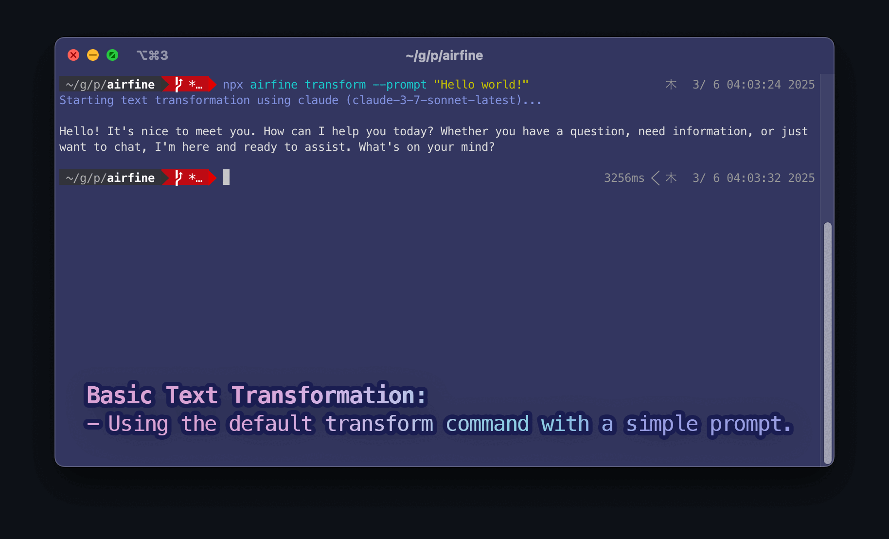

# airfine: A Minimal LLM-based Text Refinement CLI


AIrfine is a lightweight, versatile CLI connector for LLM APIs (OpenAI, Claude, Gemini) that enables seamless text transformation through simple commands. It serves as an atomic building block that can be integrated with various tools and workflows to enhance text processing capabilities.

## Why AIrfine?

AIrfine was designed with the following principles in mind:

- **Simplicity**: Minimal interface with maximum flexibility
- **Composability**: Works well with other tools in the Unix philosophy
- **Integration**: Easy to incorporate into scripts, automation workflows, or GUI wrappers
- **Extensibility**: Support for multiple LLM providers with a consistent interface

Once set up, AIrfine becomes a powerful component in your toolkit that can be accessed via shell commands or integrated into GUI applications, enabling you to easily incorporate LLM capabilities into your existing workflows.



## Quick Start

You can use airfine without installation using npx:

```bash
npx airfine --help
```

> **Note**: If npx is not available on your system, you need to install Node.js (version 18.0.0 or higher) from [nodejs.org](https://nodejs.org/).
>
> The package is fully bundled, so no additional dependencies are needed when running with npx.

### Example with npx

```bash
npx airfine transform --prompt "Improve this text" --context "Make it more professional"
```

## Installation

If you use airfine frequently, you may want to install it globally:

### Install from npm

```bash
npm install -g airfine
```

### Install from source

```bash
git clone https://github.com/yukimi-inu/airfine.git
cd airfine
npm install
npm run build
npm link
```

## Usage

### Setup

On first use, you need to configure API keys for the LLM providers:

```bash
airfine setup
```

Follow the prompts to enter your API keys. For security, API keys are masked with asterisks (\*) as you type. Keys are saved to `~/.config/airfine/config.json`.

You can also configure default settings:

- **Default Provider**: Set which provider to use when none is specified
- **Default Models**: Set which model to use for each provider when none is specified

```bash
# To set the default provider
airfine setup
# Select "Set default provider" from the menu

# To set default models for each provider
airfine setup
# Select "Set default models" from the menu
```

### List Available Models

To see which models are available with your API keys:

```bash
airfine models
```

This command queries each configured provider's API and displays a list of available models.

### Text Transformation

To transform text, use the following command:

```bash
airfine transform --prompt "Text to transform" [--context "System message"] [--provider "Provider name"] [--model "Model name"] [--quiet]
```

#### Options

- `--prompt`, `-p`: Text to transform (required unless using stdin)
- `--context`, `-c`: System message (optional, if not provided, no context will be sent to the LLM)
- `--provider`, `-r`: LLM provider to use (optional, default: claude if configured, otherwise any available provider)
- `--model`, `-m`: Model to use (optional, provider-specific default will be used if not specified)
- `--quiet`, `-q`: Output only the result text without any logs (optional)
- `--raw`: Alias for --quiet
- `--stdin`, `-s`: Read prompt from stdin (optional, automatically detected if content is piped)

### Examples

1. Expand a list:

```bash
airfine transform \
  --context "Expand the following list into a well-structured document" \
  --prompt "- Requirements gathering\n- Implementation plan\n- Deployment procedure"
```

2. Free-form transformation:

```bash
airfine transform \
  --prompt "Please format this text in Markdown with proper paragraphs to make it more readable"
```

3. Specify provider and model:

```bash
airfine transform \
  --provider "openai" \
  --model "gpt-4o" \
  --prompt "Summarize this article in three bullet points"
```

4. Output only the result (useful for scripting):

```bash
airfine transform \
  --prompt "Translate this to French" \
  --quiet > output.txt
```

5. Read prompt from stdin:

```bash
# Using the --stdin flag
echo "This is text to improve" | airfine transform --stdin

# Automatically detected when piped
echo "This is text to improve" | airfine transform
```

## Integration Examples

AIrfine can be easily integrated with other tools and workflows:

### Shell Pipelines

```bash
# Translate a file to French
cat document.txt | airfine transform --prompt "Translate this to French" --quiet > document_fr.txt

# Summarize meeting notes
cat meeting_notes.md | airfine transform --prompt "Summarize these meeting notes in bullet points" --quiet

# Process file content directly (stdin is automatically detected)
cat document.txt | airfine transform --context "You are a professional editor. Improve this text." > improved_document.txt
```

The CLI automatically detects when content is being piped in, so you don't need to use the `--stdin` flag explicitly in most cases.

### Script Integration

```bash
#!/bin/bash
# Example script that processes multiple files
for file in *.txt; do
  echo "Processing $file..."
  airfine transform --prompt "Improve this text" --quiet < "$file" > "improved_$file"
done
```

### GUI Wrappers

AIrfine's simple CLI interface makes it ideal for building GUI wrappers around it:

- Text editors with LLM-powered features
- Desktop applications for content creation
- Browser extensions for text refinement

## Supported Providers and Models

### OpenAI

- gpt-4o
- gpt-4o-mini
- o1
- o1-mini
- o3-mini

### Anthropic (Claude)

- claude-3-sonnet-latest
- claude-3-opus-latest
- claude-3-haiku-latest

### Google (Gemini)

- gemini-2.0-flash
- gemini-2.0-flash-lite
- gemini-1.5-pro

## Development

### Testing

Run tests with:

```bash
npm test
```

Run tests in watch mode:

```bash
npm run test:watch
```

Generate test coverage:

```bash
npm run test:coverage
```

### Code Formatting

Format code with Biome:

```bash
npm run format
```

Lint code:

```bash
npm run lint
```

## Publishing to npm

### Prerequisites

1. Create an npm account at [npmjs.com](https://www.npmjs.com/signup)
2. Log in to npm from your terminal:

```bash
npm login
```

3. Set up the `NPM_TOKEN` secret in your GitHub repository:
   - Generate an npm access token: `npm token create`
   - Go to your GitHub repository → Settings → Secrets and variables → Actions
   - Create a new repository secret named `NPM_TOKEN` with the value of your npm token

### Manual Publishing

To manually publish to npm:

```bash
# Update version in package.json
npm version patch  # or minor, or major
npm publish
```

### Automatic Publishing via GitHub Actions

This project is configured to automatically publish to npm when a new version tag is pushed to GitHub.

To release a new version:

1. Update the version in package.json:

```bash
npm version patch  # or minor, or major
```

2. Push the changes and the new tag:

```bash
git push && git push --tags
```

The GitHub Actions workflow will automatically build, test, and publish the package to npm.

### Publishing Checklist

Before publishing, ensure:

1. All tests pass: `npm test`
2. The package builds correctly: `npm run build`
3. The version in package.json is updated
4. The package.json contains all necessary metadata:
   - name, version, description
   - main, bin, files
   - keywords, author, license
   - repository, bugs, homepage
   - publishConfig (for public packages)
5. The README is up-to-date
6. The .npmignore or files field in package.json is correctly configured

## Requirements

- Node.js 18.0.0 or higher
- API keys for at least one of the supported LLM providers

## License

MIT

## Future Enhancements

- Interactive chat mode (`airfine chat`)
- Message history
- Distribution via Brew, apt, and as a single binary
